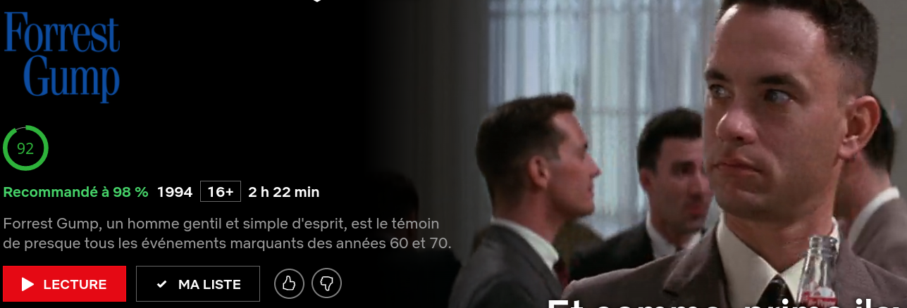

# Sencritique
Permet d'avoir un score Allociné et SensCritique sur les pages de descriptions Netflix

[Cliquez ici pour installer l'extension depuis le store firefox](https://addons.mozilla.org/fr/firefox/addon/noteflix/)

## Fonctionnement du score
Le score correspond à la note globale des spectateurs Allociné/SensCritique en pourcentage plutot qu'une note sur 5 ou sur 10.
Exemple: 
- 4,5/5 devient 90 (vert)
- 2,5/5 devient 50 (jaune)
- 1.5/5 devient 30 (orange)
- 1/5 devient 20 (rouge)
Le score est clickable et renvoi directement vers la fiche de critique du film ou de la série.

Si le score n'est pas trouvé, un point d'interrogation sera affiché, l'indicateur est clickable et renvoi vers la recherche de film ou série pré-rempli.

# Screenshots

# Téléchargement
- [Chrome](https://chrome.google.com/webstore/detail/noteflix/ahoplkcmcgpbkimjhncpnnllgikapjoj)
- [Firefox](https://addons.mozilla.org/en-US/firefox/addon/noteflix/)

# Contribuer
Si vous désirez contribuer au projet [veuillez lire la charte de contribution](CONTRIB.md)
