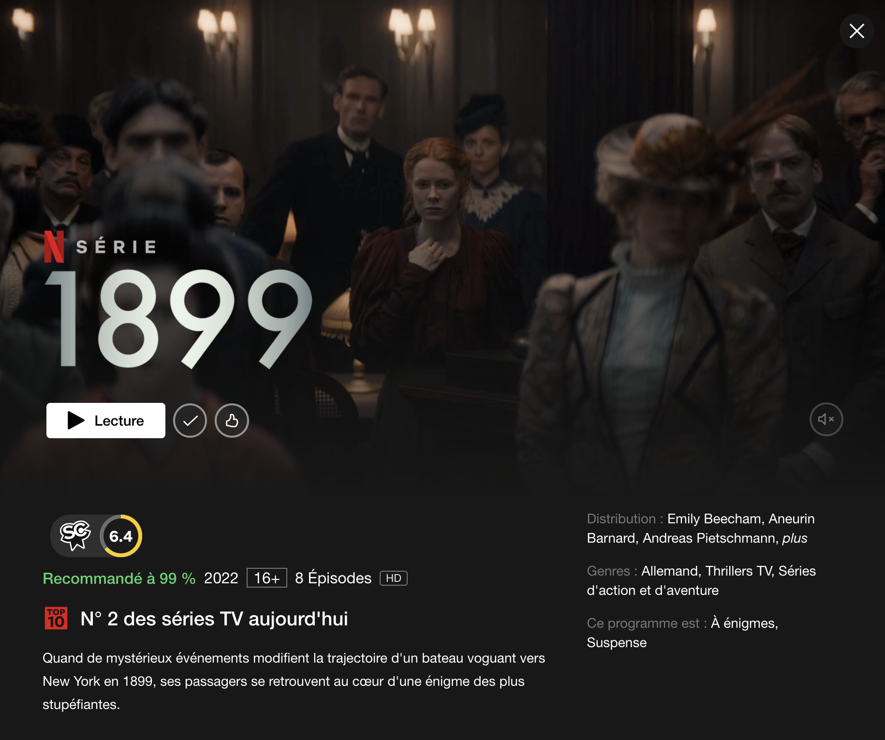
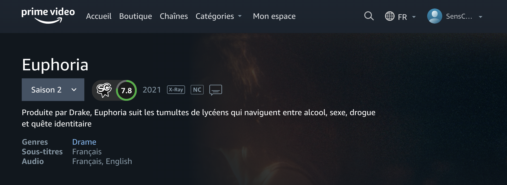

# SensCritique-extension

Permet d'avoir un score SensCritique sur les pages de descriptions **[Netflix](https://www.netflix.com)**, **[Disney+](https://www.disneyplus.com)** et **[Prime video](https://www.primevideo.com)**.

## Fonctionnement du score

Le score correspond à la note globale des spectateurs SensCritique en pourcentage plutôt qu'une note sur 5 ou sur 10.

Exemples :

- À partir de 6,5/10 le cercle sera vert
- De 5,5/10 à 6,4/10 le cercle sera jaune
- En dessous de 5,5/10 le cercle sera rouge

Le score est cliquable et renvoie directement vers la page de la critique du film ou de la série.

Si le score n'est pas trouvé, un point d'interrogation sera affiché. L'indicateur est cliquable et renvoie vers la page de recherche de SensCritique pré-remplie.

# Extension disponible sur

## **[NETFLIX](https://www.netflix.com)**

## **[DISNEY+](https://www.disneyplus.com)**

## **[AMAZON](https://www.amazon.com)**

# Téléchargement

- [Chrome](https://chrome.google.com/webstore/detail/senscritique/enficnaijgnbdbdcpbplmbnhoenehllk?hl=fr)
- [Firefox](https://addons.mozilla.org/fr/firefox/addon/senscritique/)

# Contribuer

Si vous désirez contribuer au projet [veuillez lire la charte de contribution](CONTRIB.md)
